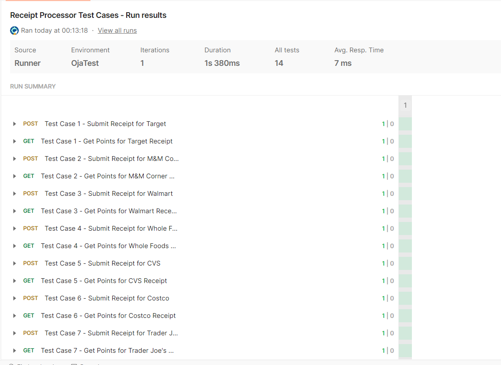

# Receipt Processor

## Overview

The Receipt Processor is a simple RESTful API built using Flask that processes receipts to calculate loyalty points based on [predefined rules](https://github.com/fetch-rewards/receipt-processor-challenge?tab=readme-ov-file#rules). The application allows users to submit a receipt and retrieve the corresponding points awarded.

[Fetch Rewards Challenge](https://github.com/fetch-rewards/receipt-processor-challenge)

## Features

- Process receipts submitted in JSON format.
- Calculate points based on several criteria, including:
  - Alphanumeric characters in the retailer name.
  - Total amount conditions.
  - Number of items in the receipt.
  - Specific rules related to item descriptions, purchase date, and time.

## Technologies Used

- Python
- Flask
- Docker

## Requirements

- Python 3.9 or higher
- Docker (for containerization)

## Installation

### Clone the Repository

```bash
git clone https://github.com/ritvij-saxena/receipt-processor-flask.git
cd receipt-processor-flask
```

### Create a Virtual Environment (Optional)

```bash
python -m venv venv
source venv/bin/activate  # On Windows use `venv\Scripts\activate`
```

### Install Dependencies

Create a `requirements.txt` file in the project root with the following content:

```
Flask==2.3.2
```

Install the dependencies using pip:

```bash
pip install -r requirements.txt
```

## Running the Application Locally

To run the Flask application locally without Docker, execute the following command:

```bash
python app.py
```

The application will start on `http://localhost:8080`.

### API Endpoints

- **POST** `/receipts/process`: Submit a receipt in JSON format.

  **Request Body Example**:
  ```json
    {
    "retailer": "Target",
    "purchaseDate": "2022-01-01",
    "purchaseTime": "13:01",
    "items": [
        {
        "shortDescription": "Mountain Dew 12PK",
        "price": "6.49"
        },{
        "shortDescription": "Emils Cheese Pizza",
        "price": "12.25"
        },{
        "shortDescription": "Knorr Creamy Chicken",
        "price": "1.26"
        },{
        "shortDescription": "Doritos Nacho Cheese",
        "price": "3.35"
        },{
        "shortDescription": "   Klarbrunn 12-PK 12 FL OZ  ",
        "price": "12.00"
        }
    ],
    "total": "35.35"
    }
  ```

  **Response Example**:
  ```json
  { "id": "7fb1377b-b223-49d9-a31a-5a02701dd310" }
  ```

- **GET** `/receipts/{id}/points`: A simple Getter endpoint that looks up the receipt by the ID and returns an object specifying the points awarded.

  **Response Example**:
  ```json
  { "points": 32 }
  ```

## Running the Application with Docker

1. **Build the Docker Image**

   Navigate to the project directory and run the following command:

   ```bash
   docker build -t receipt-processor .
   ```

2. **Run the Docker Container**

   Map port `8080` from the container to port `8080` on your host:

   ```bash
   docker run -p 8080:8080 receipt-processor
   ```

3. **Access the API**

   The application will be accessible at `http://localhost:8080`.


## Testing with Postman
A Postman collection/test suite file, `Receipt Processor Test Cases.postman_collection.json`, is included with the project. You can import this file into Postman as a collection. Once imported, ensure the server is running and execute the test suite to validate the application's functionality. 



Helpful Links:
- [Importing data in Postman](https://learning.postman.com/docs/getting-started/importing-and-exporting/importing-data/)
- [Running a Test suite](https://learning.postman.com/docs/tests-and-scripts/run-tests/run-tests-manually/)
- [Postman Learning Centre](https://learning.postman.com/docs/introduction/overview/)


### Improvements (Food for thought)

#### 1. Modularization and Blueprints

Present Method: There may be only one module or little modularization in the Flask application.
Enhancement: To improve scalability and maintainability, divide the application into distinct modules (for points, receipts, etc.) using Flask Blueprints.

#### 2. Using Flask-Testing for API Testing

The current methodology is simple unit testing.
Enhancement: To enhance test coverage, employ Flask-Testing by incorporating sophisticated functionalities like database setup and teardown or external service mocking.

#### 3. CORS Handling Improvement

Use Flask-CORS to manage Cross-Origin Resource Sharing if the application is meant to be accessible from several origins (such as a frontend app or mobile app).

#### 4. Rate Limiting Improvement

To stop abuse of the API endpoints, implement rate limiting. Either manually tracking requests by IP/user or by using Flask's middleware, this can be accomplished.

#### 5. Consider Database Strategies and Make Use of Flask-Migrate Improvements

Think of using a integrating a persistent database such as MySQL, PostgreSQL, or MongoDB to store receipts and points. This will ensure data survives application restarts and scales better. Flask-Migrate to handle database migrations with ease when moving to a persistent database (such as PostgreSQL or MySQL).


We can certainly explore the trade-offs and find the "mostly" correct answer for this problem.

## Acknowledgment

I want to extend a big thank you to Fetch Rewards for offering such an awesome learning experience.
I’d love the opportunity to interview with Fetch!
